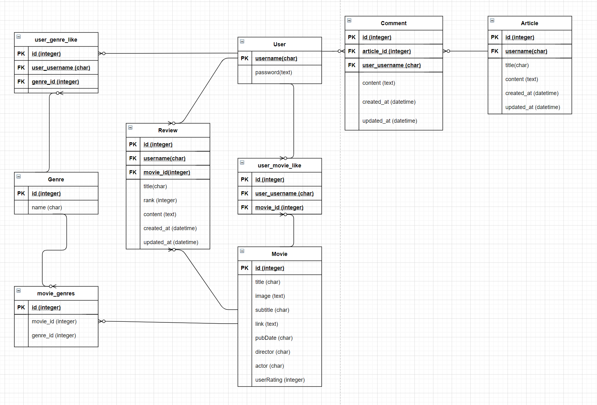
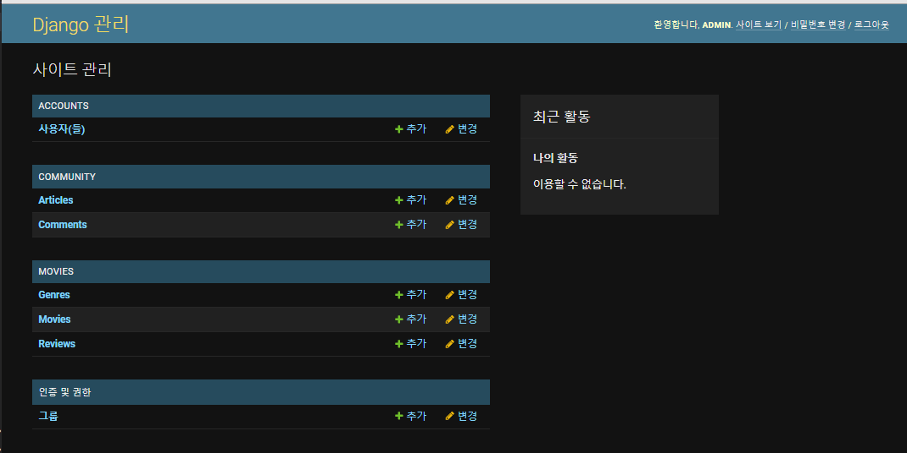
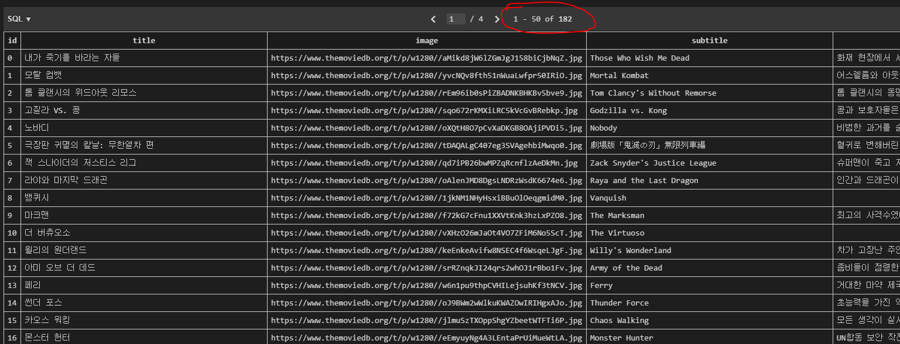
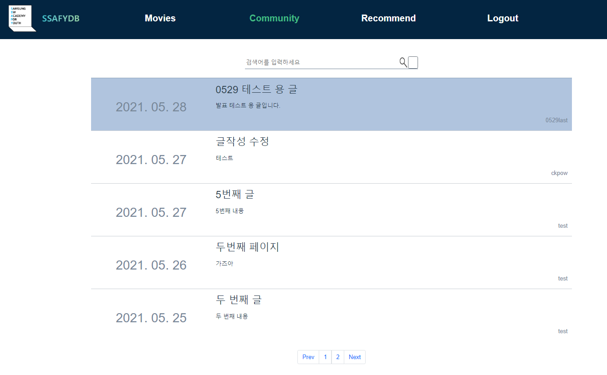
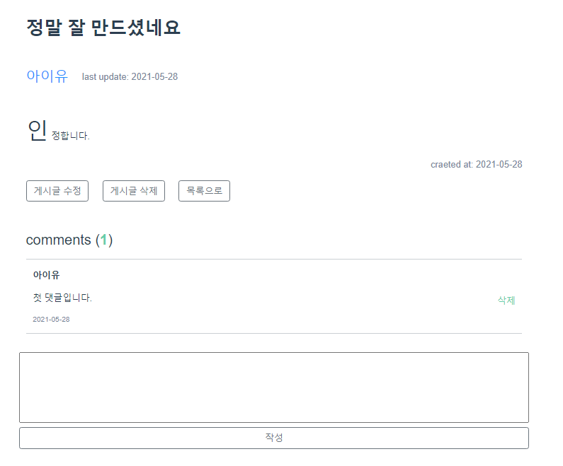
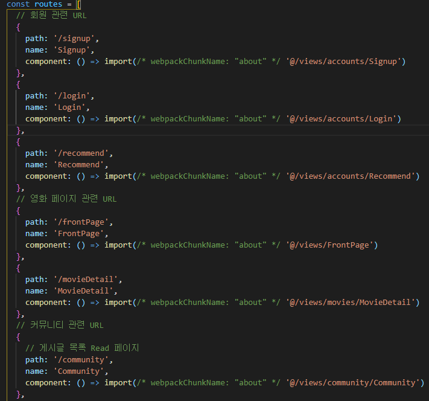
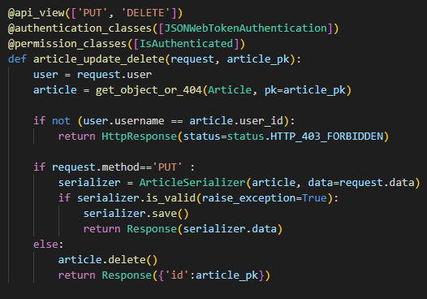
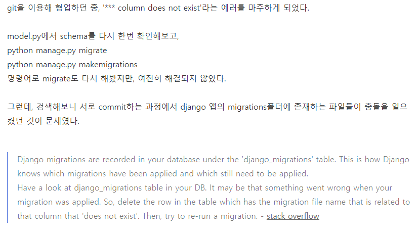

삼성청년소프트웨어아카데미(SSAFY) 1학기 최종 관통 프로젝트 영화 커뮤니티 제작

  - 기간: 21.05.20 ~ 21.05.28 (학습 기간 21.03 ~ 21.05)

  - 기술스택 및 사용 툴: Vue.js(node.js를 통한 CLI), Django, Django REST API, Bootstrap, Sqlite, TmDB api, Youtube API, Vscode, Chrome Browser, Vanilla JS, Node.js

  - 내용:
    삼성청년SW아카데미 1학기 최종 관통 프로젝트로서 1학기 동안  배운 내용을  토대로 영화 커뮤니티 웹사이트 제작 진행함.      

    외부 영화 API를 활용하여 DB를 구축하고, node.js를 통해 활용한 Vue.js(CLI)를 통해 프론트단을, Django를 통해 Restful하게 백단을 구성하고 css과 Bootstrap을 이용하여 디자인을 꾸몄음.

  - 기본 요구 사항:
   - 관리자 뷰 (Django내에서 admin.py에 만든 기능들 연결 후 superuser 계정을 생성하여 완료)
     
     :white_check_mark: 관리자 권한의 유저만 영화 등록/ 수정 / 삭제 권한 가짐.
     
     :white_check_mark: 관리자 권한의 유저만 유저 관리 권한을 가짐.
     
     :white_check_mark: 장고에서 기본적으로 제공하는 admin 기능 이용하여 구현
   - 영화 정보(Tmdb API를 통해 영화정보를 가져오고 이를 구조에 맞게 수정 후 DB구축)
     
     :white_check_mark: 영화 정보는 최소 50개 이상의 데이터가 존재하도록 구성
     
     :white_check_mark: 모든 로그인 된 유저는 영화에 대한 평점 등록 / 수정 / 삭제 등이 가능해야함.
   - 추천 알고리즘(콜드 스타트에 대비하여 다양한 장르들의 대표작들을 선택할 수 있도록 제공하고, 사용자의 선택에 따라 영화 추천)
     
     :white_check_mark: 평점을 등록한 유저는 해당 정보를 기반으로 영화를 추천 받을 수 있어야 함.
     
     :white_check_mark: 추천 알고리즘의 지정된 형식은 없으나, 사용자는 반드시 최소 1개 이상의 방식으로 영화를 추천 받을 수 있어야 함.
     
     :white_check_mark: 추천 방식은 각 팀별로 자유롭게 선택할 수 있으며 어떠한 방식으로 추천 시 스템을 구성 했는지 설명할 수 있어야 함.
   - 커뮤니티
     
     :white_check_mark: 영화 정보와 관련된 대화를 할 수 있는 커뮤니티 기능을 구현해야 함.
     
     :white_check_mark: 로그인한 사용자만 글을 조회 / 생성 할 수 있으며 작성자 본인만 글을 수정 / 삭제 할 수 있음
     
     :white_check_mark: 사용자는 작성된 게시글에 댓글을 작성할 수 있어야 하며 작성자 본인만 댓 글을 삭제 할 수 있음
     
     :white_check_mark: 각 게시글 및 댓글은 생성 및 수정 시각 정보가 포함되어야 함
   - 기타
     
     :white_check_mark: 최소한 5개 이상의 URL 및 페이지를 구성해야 합니다.
     
     :white_check_mark: HTTP Method와 상태 코드는 상황에 맞게 적절하게 반환되어야 하며, 필요에 따라 메시지 프레임워크 등을 사용하여 에러 페이지를 구성해야 합니다
     
     :white_check_mark: 필요한 경우 Ajax를 활용한 비동기 요청을 통해 사용자 경험을 적절하게 향 상 시켜야 합니다
  - 추가 구현 기능(자율적으로 수행):
    
    :white_check_mark: 인피니트 스크롤, 캐로셀 등의 디자인 적인 요소 추가
    
    :white_check_mark: 사용자의 경험을 위한 비동기식(ajax) 코드 추가 구현(사진 불러올 때 등)
    
    :white_check_mark: 유튜브 api를 활용하여 리뷰 페이지에서 영화의 트레일러 영상 제공
    
    :white_check_mark: 커뮤니티 페이지에서 게시글들 검색 기능 추가
    
    :white_check_mark: 회원 가입 시 비밀번호 일치 여부 제공, 로그인 시 자동 저장 기능 추가.

  - 역할:
    팀장, 아이디어 구상 및 모델 및 컴포넌트 구조 구성, 초기 BE 담당, 추가 기능 구현
    사용자 경험을 우선으로 한 디자인 작업, 예외 처리, 발표 자료 준비 및 발표

```
레포 주소: https://github.com/CHASEONGMIN/Projects/tree/main/MainProjects/SSAFY_5TH_firstsemester_final_pjt

시연 이전 부분까지의 내용 ppt: https://github.com/CHASEONGMIN/Projects/blob/main/MainProjects/SSAFY_5TH_firstsemester_final_pjt/210528_5%EA%B8%B0_%EB%8C%80%EC%A0%84_2%EB%B0%98_%EA%B4%80%ED%86%B5PJT_%EC%A1%B0%EC%9B%85%ED%98%84_%EC%B0%A8%EC%84%B1%EB%AF%BC.pptx
 
```


### SSAFY_DB 싸피 5기 1학기 최종 관통 프로젝트


## 0) 사전 필요 코드

```
#client

npm install 후 서버 쪽 설정 모두 진행 후
npm run serve

#server
가상환경 만들고 pip install -r requirements.txt 해주고
makemigrations, migrate 후
loaddata로 json파일들 넣어주고

python manage.py runserver로 서버 켜줌
```


## 1) 팀원 정보 및 업무 분담 내역


조웅현 : 

- **아이디어 구상** **및 모델 및 컴포넌트 구조 구성**

- **초기** **FE** **담당**

- **추천 알고리즘 구현**

- **데이터 베이스 구축**

- **사용자 경험을 우선으로 한 디자인 작업**

- **예외 처리**

차성민:

- **아이디어 구상** **및 모델 및 컴포넌트 구조 구성**

- **초기** **BE** **담당**

- **추가 기능 구현**

- **사용자 경험을 우선으로 한 디자인 작업**

- **예외 처리**

- **발표 자료 준비 및 발표**


## 2) 목표 서비스 구현 및 실제 구현 정도

- [x]  관리자 뷰에서 권한가지고 제어 가능
- [x] 영화 정보 데이터 가져오고, 로그인 된 유저 평점 등록 / 수정 / 삭제 가능
- [x] 추천 알고리즘을 통한 맞춤형 영화 추천 제공
- [x] 게시글 조회/ 생성/ 수정/ 삭제 가능한 커뮤니티 제작 및 게시글 내 댓글 생성/ 삭제 가능
- [x] 5개 이상의 URL 및 페이지 구성, 필요에 따라 에러 페이지 구성, Ajax를 활용한 비동기 요청을 통해 사용자 경험을 향상.

#### 모든 항목 100% 구현 완료.

+ 추가 기능: 인피니트 스크롤, 페이지네이션, 폰트 등의 디자인 요소, 유튜브 API활용하여 영화 디테일페이지에서 영화 트레일러 제공, 로그인 시 remember me기능 추가, 커뮤니티에서 검색 기능 추가, 비밀번호 일치여부 판별, 각종 알림 창들 추가

#### 추가 기능들 모두 100% 구현 완료.


## 3) 데이터베이스 모델링(ERD)




## 4) 필수 기능에 대한 설명

- [x]  관리자 뷰에서 권한가지고 제어 가능
  - admin.py를 통해 권한 등록해주어 구현하였습니다.



- [x] 영화 정보 데이터 가져오고, 로그인 된 유저 평점 등록 / 수정 / 삭제 가능

  - TDMB API를 통해 가져온 json을 우리의 입맛에 맞게 커스텀하여 50개 이상의 영화 데이터 베이스 구축

  

  - 토큰 활용하여 로그인 된 유저만 평정 등록, 수정, 삭제가 가능하도록 구현

  

- [x] 추천 알고리즘을 통한 맞춤형 영화 추천 제공

  - **비회원 및 영화 미 선택 회원은 데이터 베이스 내부 정보를 토대로 추천**
  - **사용자의 영화 선택 데이터와****,** **데이터 베이스 내부 정보를 토대로 추천 영화 제공**


자세한 항목은 내부 코드 참조.

- [x] 게시글 조회/ 생성/ 수정/ 삭제 가능한 커뮤니티 제작 및 게시글 내 댓글 생성/ 삭제 가능
  - 게시글 조회는 누구나, 생성은 로그인한 유저만, 수정 및 삭제는 본인만 가능하도록 구현
  - 댓글의 생성은 로그인한 유저만, 삭제는 본인만 가능하도록 구현





- [x] 5개 이상의 URL 및 페이지 구성, 필요에 따라 에러 페이지 구성, Ajax를 활용한 비동기 요청을 통해 사용자 경험을 향상.



- url 및 페이지 구성



- **작성자 본인이 아닐 때 등의 상황에서 에러 페이지**

- Ajax 활용은 정말 많이 써서 내부 코드 참조바람.


## 5) 배포 서버 URL

사용한 유튜브 api의 사용량 제한을 감안하여 배포를 하지 않았음.

http://localhost:8080/


## 6) 기타(느낀점)

조웅현 : 처음으로 파이썬 장고와 뷰를 배워서 웹 애플리케이션을 만들었는데, 생각보다 어려웠지만 다양한 API를 활용하고 기능등을 구현하면서 SSAFY 하기 전과 비교했을 때 스스로 많이 성장한 것 같습니다. 2학기의 프로젝트 경험을 통해서 더욱 성장하고 싶습니다


차성민: 프론트와 백, 그리고 서버 하나하나씩 공부하며 익히고, 이를 관통 프로젝트로 가져와 하나의 웹 어플리케이션을 만드는 과정이 정말 좋았던 것 같다. 필요한 API를 활용하여 데이터를 가져오고, 이를 사용하고자하는 포맷에 맞게 데이터 베이스에 넣어주어 활용하고, 백에서 로직을 작성하고, 이를 프론트에서 잘 보여질 수 있도록 꾸며주는 과정을하며 많은 벽을 만나고 이슈를 만나고했지만 하나씩 해결해나가며 기어코 목표를 달성했다는 점이 매우 자랑스럽다.

거기에 더 나아가 기본적인 필수 기능 이외에도 다양한 추가 기능들을 넣어보고자 노력하였고, 상당한 수의 추가 기능까지 구현을 완료하였다. 나는 백엔드를 초반에 맡다가 막바지에 프론트엔드 경험도 할 수 있었는데, 프론트엔드는 여전히 잘 안 맞는것 같고 어색하지만 보다 익숙해질 수 있도록 노력할 것이다.




위와 같이 이슈가 발생하고 이를 해결해가면서 많은 분들의 도움을 얻었는데, 나도 추후에 위와 같이 다른 분들께 도움을 드리는 개발자가 될 수 있도록 노력할 것이다.


### 커밋 내역
https://github.com/tofan0412/final-pjt/commits/master


